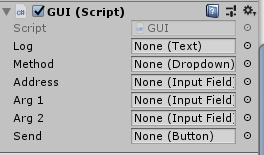
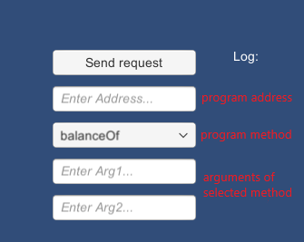

# Sample of Unity app on Expload platform

This is a simple app that using Unity implementaion of [Pravda DApp API](https://github.com/expload/pravda/blob/master/doc/dapp-api.md) for Expload Desktop. 

**Important note:**
The generated code uses [Json .NET](https://www.newtonsoft.com/json) library for hadling Json.
You can download Unity version of it from [AssetStore](https://assetstore.unity.com/packages/tools/input-management/json-net-for-unity-11347).

## Installation

 1. Clone this repo 
 2. Open `ProgramTest` as Unity Project
 3. Select `SampleScene`
 3. Select Send Button in Canvas 
 4. Select `GUI.cs` as Script for this button 

## Structure of the repository 
`Assets` contains C# sources including:
 - [`ExploadUnityCodegen.cs`](ProgramTest/Assets/ExploadUnityCodegen.cs) is auxiliary file for generated `Program.cs` that forms requests and parses responses of DApp API.  
 - [`Program.cs`](ProgramTest/Assets/Program.cs) is generated file that exposes functionality to call program's methods and parse the raw results.  
 - [`GUI.cs`](ProgramTest/Assets/Scenes/GUI.cs) operates with Unity graphics and UI and uses functionality from `Program.cs`. 

`Program.cs` was automatically generated from other C# source file by [Pravda Dotnet translator](https://github.com/expload/pravda/blob/master/doc/ref/dotnet/translation.md) and [Pravda code generatation for unity](https://github.com/expload/pravda/blob/master/doc/codegen.md).

### Dotnet translation 
[`SmartProgram.cs`](https://github.com/expload/pravda/blob/master/dotnet-tests/resources/SmartProgram.cs) is C# source file that is compiled to `SmartProgram.exe` and translated to Pravda program `SmartProgram.pravda` by the following commands: 
```
csc SmartProgram.cs -reference:Pravda.dll
pravda compile dotnet -i SmartProgram.exe -o SmartProgram.pravda
``` 
You can find `Pravda.dll` [here](https://github.com/expload/pravda/blob/master/PravdaDotNet/Pravda.dll).

`Program.cs` and `ExploadUnityCodegen.cs` were generated from `SmartProgram.pravda`:
```
pravda gen unity -i SmartProgram.pravda
```
This command will create `Assets` folder and place all generated files to it. 

### SmartProgram
`SmartProgram.cs` contains three methods: 
 - `Emit` that emits tokens to the sender's balance;
 - `BalanceOf` that checks balance of the given address;
 - `Tansfer` that can transfer coins to other address.

`pravda gen unity` analyses these methods and generate appropriate classes (`EmitRequest`, `BalanceOfRequest`, `TransferRequest`) in `Program.cs`. 
For detailed description of how these classes were genereated you can look [here](https://github.com/expload/pravda/blob/master/doc/codegen.md).

## GUI
This Unity app has very simple GUI where you should specify address of program in the blockchain, what method to run and arguments for chosen method. 

It contains only `SampleScene` that is shown at the following picture:



